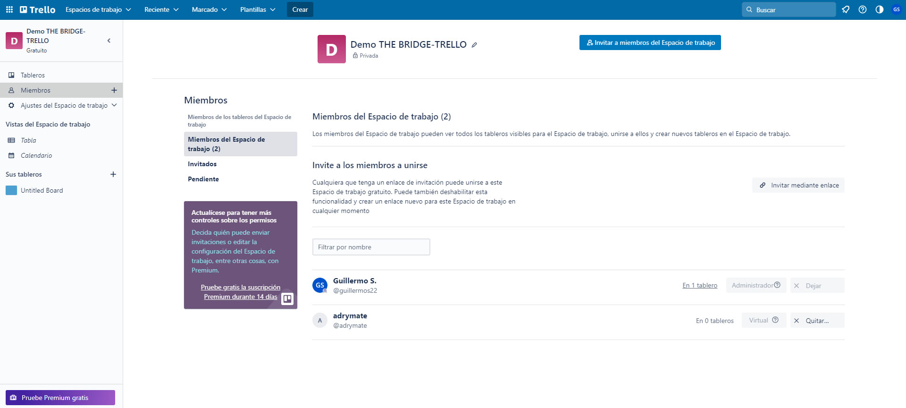
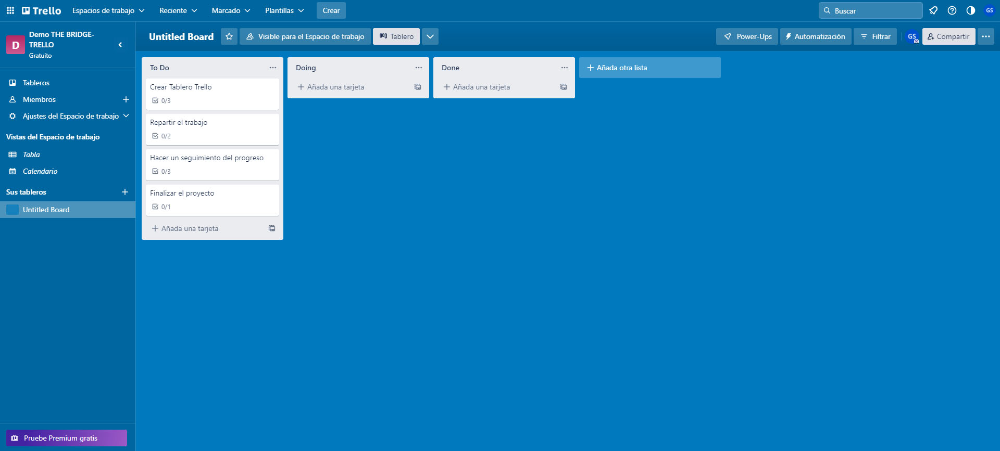
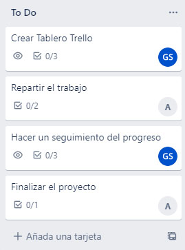
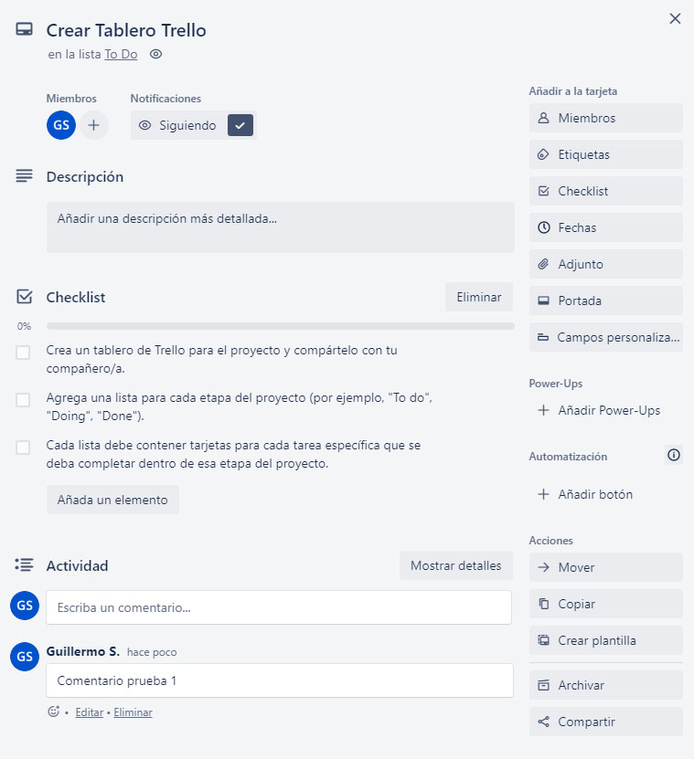
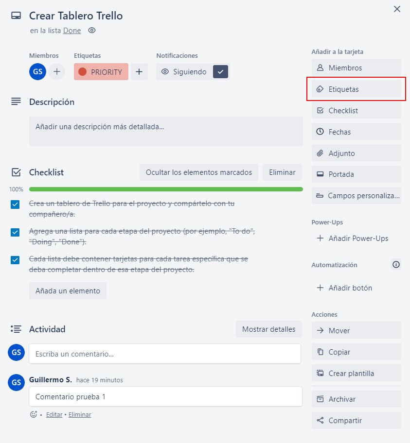
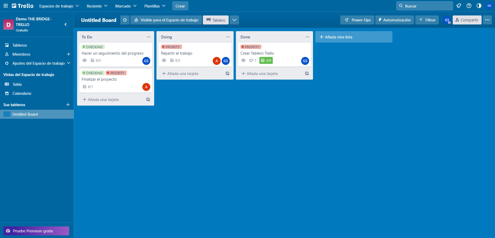
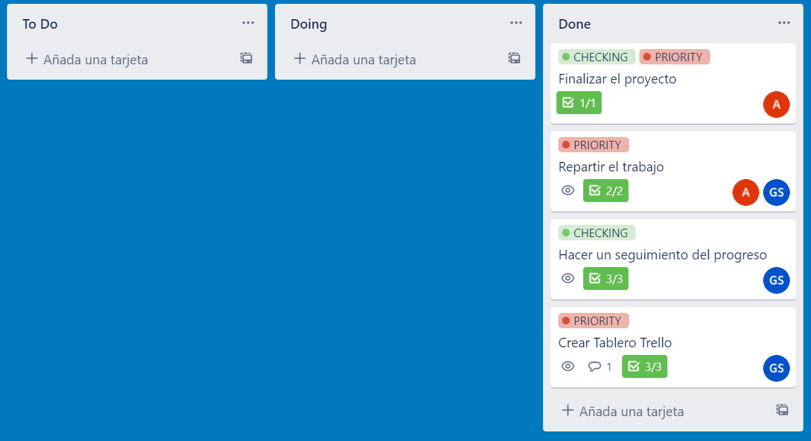

# TRELLO - MONGO DB

### ¿Cuáles son los principales objetivos de estos ejercicios?
El objetivo de este proyecto es que los estudiantes exploren las características, ventajas y desventajas de MongoDB, una base de datos NoSQL muy popular en la actualidad, a través de una investigación teórica y práctica. 

## 1.Parte 1. Trello

# Crear un tablero de Trello para el proyecto:

- Crea un tablero de Trello para el proyecto y compártelo con tu compañero/a.

- Agrega una lista para cada etapa del proyecto (por ejemplo, "To do", "Doing", "Done").
- Cada lista debe contener tarjetas para cada tarea específica que se deba completar dentro de esa etapa del proyecto.

# Repartir el trabajo:

- Asigna las tarjetas a cada uno de los miembros del equipo para que se encarguen de las tareas específicas que se han creado.

- Utiliza la función de comentarios de Trello para comunicarte con tu compañero/a acerca del progreso y cualquier problema o duda que surja durante el proyecto.

# Hacer un seguimiento del progreso:

- Utiliza la función de checklists en las tarjetas para dividir las tareas en subtareas más pequeñas y asegurarte de que todo esté completo antes de marcar la tarjeta como terminada.

- Utiliza la función de etiquetas para categorizar las tarjetas por tema o importancia.
- Haz un seguimiento del progreso del proyecto a medida que se avanza, moviendo las tarjetas entre las listas a medida que se completan las diferentes etapas.

# Finalizar el proyecto:

- Cuando se hayan completado todas las tareas, revisa el proyecto en su conjunto para asegurarte de que todo está completo y que no hay tareas pendientes. Asegúrate de que la presentación final se haya completado antes de marcar el proyecto como terminado.

